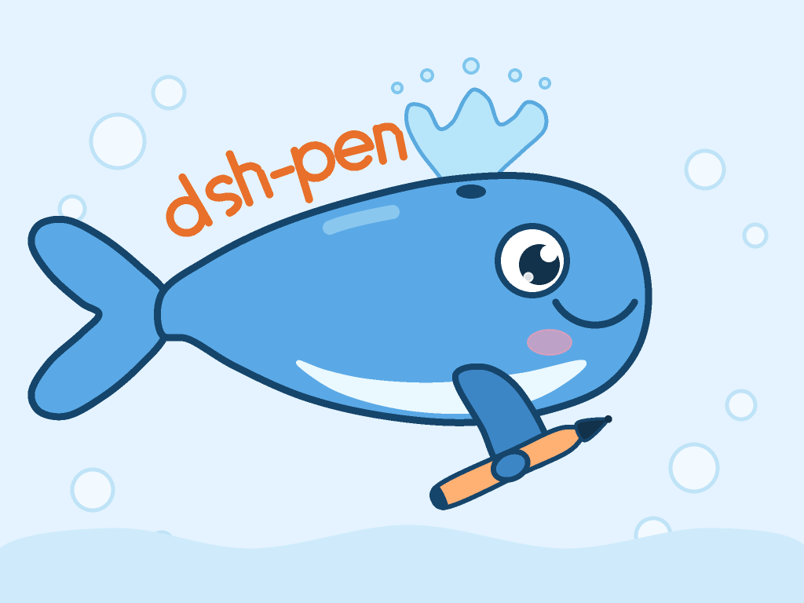

# dsh-pen（画笔画布）

DeepSeek Harness 的扩展（bundle）：给模型一块**尺寸可控的画布**、一组**可组合的笔刷**，以及
**截图回看**能力；同时在 DSH 的**右侧侧边栏**里给用户一个**可缩放、可拖动的实时画布面板**，
带「导出 PNG」按钮。

以下是 Deepseek V4.1 Flash 通过调用工具自行创作的宣传照片。



模型侧用一条 `pen_draw` 调用就能描述任意多条绘画操作（线段、折线、曲线、圆、椭圆、矩形、圆弧、
路径、填充、清空），它们按数组顺序一次画完；不同 `pen_draw` 调用之间并发安全，可以在同一条消息里
并行提交。多模态模型可以用 `pen_screenshot` 截取画布的任意矩形区域直接看图。

画布上的笔触是一条**有序列表**：下标 0 最先画、位于最底层，越靠后越在上面。因此修改图像的方式是
**像编辑文件一样编辑这条列表**——`pen_canvas` 的 `list` 动作读出带序号的笔触，`pen_edit` 按下标
删除 / 替换 / 插入 / 调整叠放顺序，`pen_draw` 也可以用 `at` 把整批新笔触插到任意位置（`at: 0` 即画在
最底层）。没有被编辑的笔触像素完全不变，模型不必为了改一个细节重画整张图、重新消耗一遍 token。

## 工具

| 工具 | 作用 |
| --- | --- |
| `pen_create` | 创建指定像素尺寸的画布（替换旧画布），可指定背景色与面板显示名 |
| `pen_draw` | 提交一批绘画操作（默认追加到最上层）；`at` 可把整批插到指定下标（`0` 即最底层）；任一操作非法则整批不画，并报出 `operations[i].<字段>` |
| `pen_edit` | 按下标编辑笔触列表：`{ index, remove, operations }` 删除 / 替换 / 插入，`{ from, to }` 调整叠放顺序；一次调用可给多条 `edits` |
| `pen_canvas` | 读取状态（尺寸、版本、操作数）、列出带序号的笔触（`action: "list"`，可 `from` / `limit` 分页）或清空当前画布 |
| `pen_screenshot` | 渲染指定区域并作为图片返回（可 `maxWidth` 缩放） |
| `pen_export` | 把画布写成 PNG 文件（默认写到会话工作目录） |

### 绘画操作（`pen_draw.operations[]`）

`kind` 取 `line` / `polyline` / `curve` / `circle` / `ellipse` / `rect` / `arc` / `path` / `fill` / `clear`。
通用笔画参数：`brush`、`color`、`strokeWidth`、`opacity`、`dash`；闭合图形（`polyline`、`curve`、
`circle`、`ellipse`、`rect`、`path`）另可给 `fill`。

- 笔刷：`pen`（默认）、`marker`、`highlighter`、`dashed`、`dotted`；`strokeWidth` / `opacity` / `dash`
  可覆盖预设。
- 颜色：`#rgb`、`#rrggbb`、`#rrggbbaa`、`rgb()` / `rgba()`、常用颜色名。
- `path` 支持 `M/m L/l H/h V/v C/c Q/q Z`；`curve` 是穿过全部控制点的 Catmull-Rom 样条。
- 坐标单位是画布像素，原点在左上角，y 向下。

### 笔触编辑（`pen_edit`）

笔触列表的下标就是绘制顺序，列表长度即“最上层”的下标，也是 `pen_draw` 不带 `at` 时的追加位置：

- `{ "index": i, "remove": n, "operations": [...] }`：从下标 `i` 起删掉 `n` 条（默认 0），再把新笔触插在该处；
  只给 `remove` 是删除，只给 `operations` 是插入，两者都给是替换。`index` 取列表长度表示追加到最上层。
- `{ "from": i, "to": j }`：把下标 `i` 的笔触取出，放到剩余列表的下标 `j` 处（`0` 压到最底层，最后一个下标提到最上层）。
- 一次调用的 `edits` 按数组顺序生效，每条的下标都以该条执行时的列表为准，因此可以在一次调用里先删后插；
  任一条非法（越界、形状混用、插入 `clear`、什么都不改）则整个调用不生效，画布保持原样。

`pen_edit` 不接受 `clear` 操作（清空交给 `pen_canvas` 的 `clear`，或直接删除整个区间），`pen_draw` 的 `at`
也不与 `clear` 同用；两者都受 `maxOperations` 上限约束。

## 用户侧面板（右侧侧边栏）

客户端半边把画布放进 DSH 右侧侧边栏，输入框上方不再占用任何空间：

- **画布页签**：以 `sidebarRightTabs` 注册页面类型 `pen`，页签正文注册在 `sidebar.right.pane.tab`
  （key = 包名），由 `sidebarRight.openTab('pen')` 打开、聚焦或关闭，可停靠/浮动/分屏，跟随会话保存布局；
- **面板内容**：每 700ms 轮询本会话画布状态，按 revision 拉取 `/pen/image` 预览，画布更新自动刷新；
- **鼠标操作**：滚轮以指针位置为锚点缩放（`0.05×`–`16×`），按住左键拖拽平移，双击或「适应窗口」
  重新贴合，右下角浮标提供 `−` / 百分比（点击回到 1:1）/ `+` / 适应窗口；
- **输入框画笔按钮**（`conversation.input.right`）：打开或聚焦画布页签，页签在最前时再点一次关闭；
  面板未打开而画布已存在时（例如模型调用 `pen_create`、或刷新页面）自动揭示一次，用户手动关闭后不再打扰；
- **动作**：**新建画布**（宽/高/背景色）、**导出 PNG**（下载全分辨率 PNG）、**清空**；
- 面板文案走客户端 locale 服务（`zh` / `en`），颜色只用 DSH 主题 token，样式表随插件卸载移除。

面板本身不做栅格化：预览图和导出的 PNG 都由 Host 渲染，所以**模型看到的截图、面板预览、导出文件
是同一份像素**（可用 sha256 直接对比验证）。

## 配置（bundle 行 `config`）

| 字段 | 默认值 | 说明 |
| --- | --- | --- |
| `defaultWidth` / `defaultHeight` | `1024` / `768` | `pen_create` 缺省尺寸 |
| `defaultBackground` | `#ffffff` | 缺省背景色 |
| `maxWidth` / `maxHeight` | `2048` / `2048` | 画布尺寸上限 |
| `previewMaxWidth` | `1400` | 面板预览图最大宽度 |
| `quality` | `2` | 超采样倍率（1–4），越大越平滑越慢 |
| `maxOperations` | `4000` | 单块画布累计操作数上限 |
| `routePrefix` | `/pen` | 浏览器路由前缀 |
| `exportDirectory` | `''` | 强制导出目录；空表示会话工作目录 |
| `promptSection` | `true` | 是否向系统提示词追加画布使用说明 |

截图输出会按 attachment store 的 `maxImageDimension` / `maxImagePixels` 自动限幅。

## 安装

```
plugin_manager install_bundle  # target: /home/rshine/toy_projects/dsh-pen
```

`cordis.patch.yml` 只插入一行；Host 半边注册工具与 `/pen` 路由，客户端半边由 `package.json`
的 `dsh.client` 声明（`platform: web`，注入 `dsh-client-ui-conversation`、`dsh-client-ui-sidebar-right`
与 `dsh-client-locale`）。客户端半边等 `sidebarRight` / `sidebarRightTabs` 两个服务就绪后才注册 UI，
因此没有右侧侧边栏的组合下它只是安静地不贡献界面。

## 开发

```
node scripts/build.mjs      # 由 lib/shared/*.js 与 lib/client-src/factory.js 生成两个产物
node tests/host.spec.mjs    # Host：工具、路由、光栅化、schema 子集、并发声明与笔触编辑
node tests/client.spec.mjs  # 客户端：模块工厂、右侧栏页签注册、面板渲染、缩放/平移手势与卸载清理
```

- `lib/shared/raster.js`：零依赖软件光栅化 + PNG 编码器（超采样抗锯齿、虚线、圆角笔画）。
- `lib/shared/ops.js`：笔刷表、操作校验/归一化、填充与描边、路径与样条解析。
- `lib/pen-shared.cjs`：**生成文件**，Host 通过 `createRequire` 引入上面的共享源码。
- `lib/client-src/factory.js`：面板源码；`lib/client/pen-client.js` 是**生成文件**（浏览器产物）。

改动 `lib/shared/` 或 `lib/client-src/` 后必须重新执行 `node scripts/build.mjs`。
